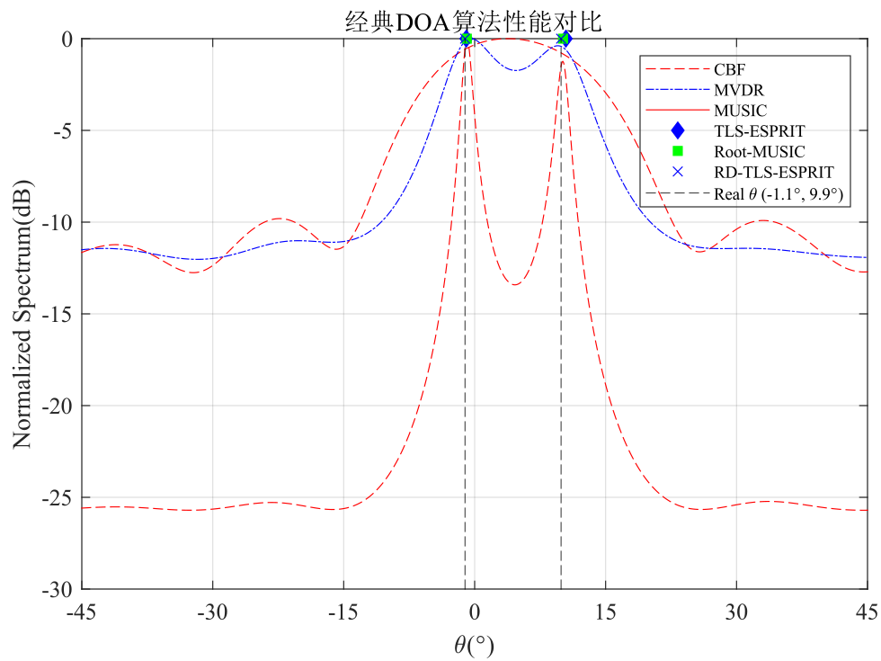

# 经典DOA估计算法
This project is a study record of the millimeter wave radar classic DOA estimation algorithm.

本项目为毫米波雷达经典DOA估计算法学习记录。

## 运行效果

DOA估计结果：

## 项目文档构成

`xxx_sim.m`为绘图程序。

`DOA_xxx.m`为算法程序。

**注意**：查看单一算法效果只需要在对应文件目录下运行`xxx_sim.m`即可。若使用`United_sim.m`进行算法联合对比时，需将各个文件目录下的`DOA_xxx.m`算法程序放置于同一文件夹内。

## 项目递交记录

2025.1.5 递交`CBF_sim.m`和`DOA_CBF.m`。

2025.1.6 递交`MVDR_sim.m`和`DOA_MVDR.m`。

2025.1.7 递交`MUSIC_sim.m`、`DOA_MUSIC.m`和`United_sim.m`。

2025.1.8 增加上述三个算法的谱峰搜索代码段。

2025.1.9 递交`LTS_ESPRIT_sim.m`和`LTS_ESPRIT_DOA.m`，并为所有算法增加运行时间输出。
